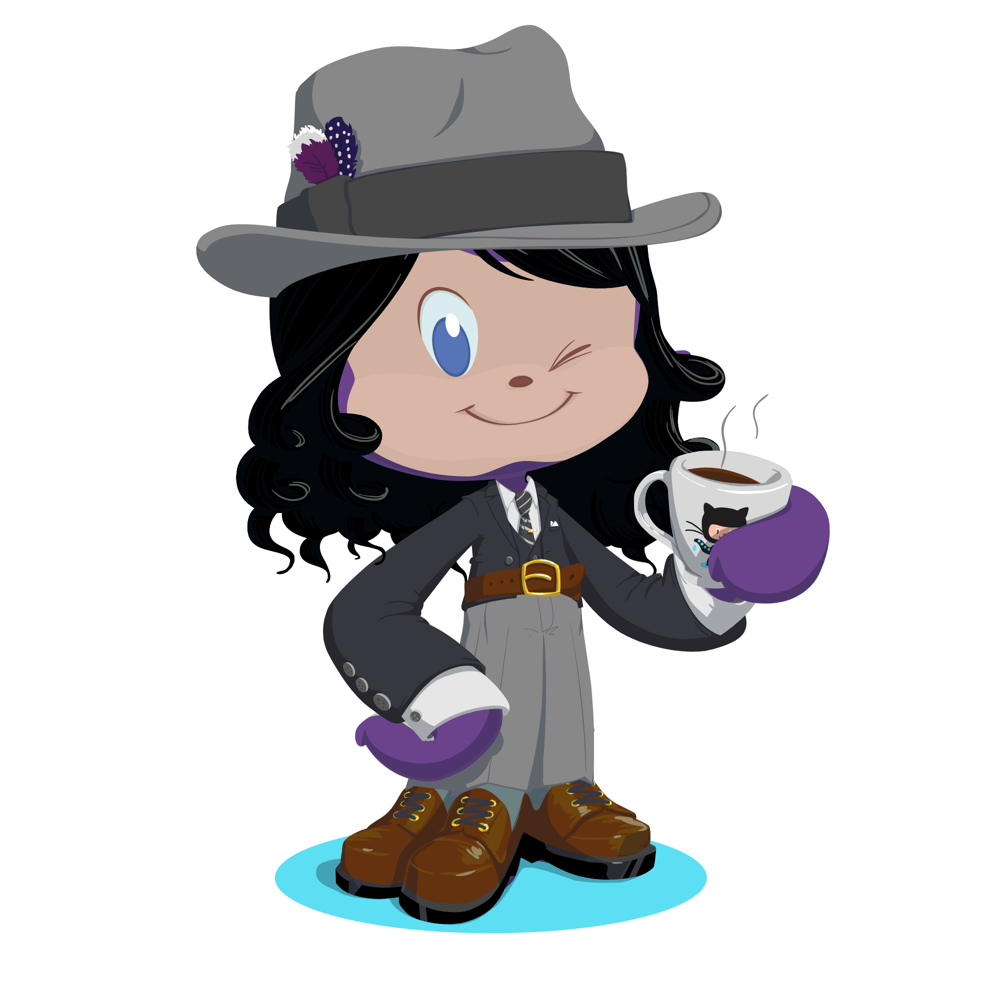

---

  

---

I'm **Wesley**, a **Systems Engineering student** at the National University of Engineering in Nicaragua. 

I focus on **problem-solving through simplicity and creativity**, applying technology as a tool rather than an end.
Experienced with **React/Next.js, .NET, Django, PostgreSQL, Docker, UiPath, n8n**, but always driven by the challenge, not the stack.
Strong soft skills: **critical thinking, adaptability, persistence, and clear communication** across technical and non-technical teams.

---

  
  
<h2>🧠 What I'm Learning Now</h2>
  
  
Strengthening my foundation in <strong>software development fundamentals</strong> to build a more integral and versatile knowledge base.
  
  
Exploring <strong>software architecture, automation flows, and design patterns</strong> to enhance scalability and maintainability.
  
  
Learning and applying <strong>AI fundamentals, development, and integration</strong> to create efficient, real-world solutions in projects.
  

  

---

## </> Skills & Tools

<table>
  <tr><th>Area</th><th>Technologies</th></tr>

  <tr>
    <td>🖥️ Frontend</td>
    <td></td>
  </tr>

  <tr>
    <td>⚙️ Backend</td>
    <td></td>
  </tr>

  <tr>
    <td>💡 Programming Languages</td>
    <td></td>
  </tr>

  <tr>
    <td>💾 Databases</td>
    <td></td>
  </tr>
</table>

---

## 📊 Activity

  

